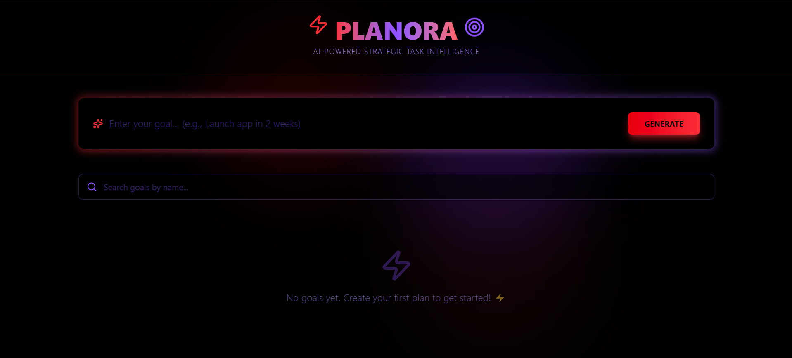
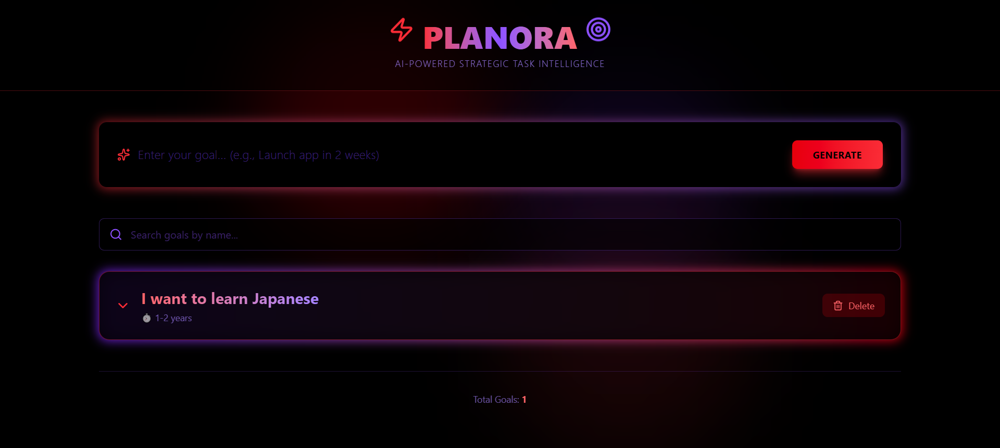
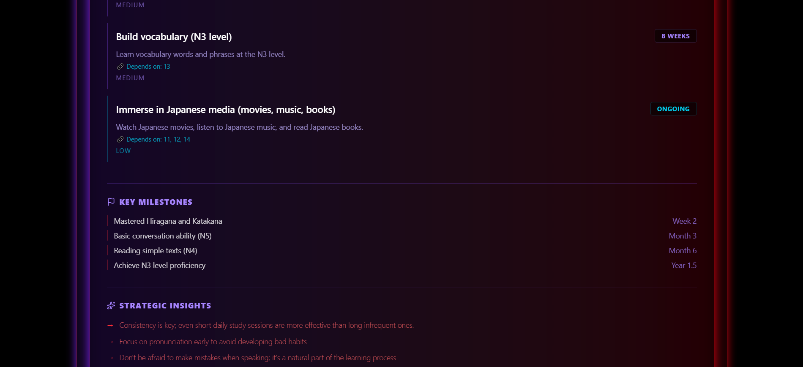
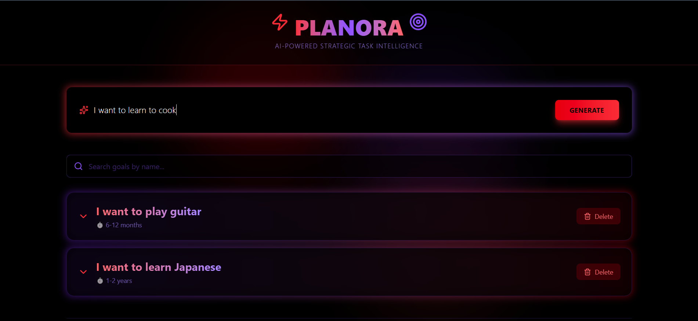

# Smart Task Planner

Smart Task Planner is an **AI-powered productivity app** that breaks down user goals into actionable tasks with timelines using intelligent reasoning.  
Built using the **MERN Stack (MongoDB, Express, React, Node.js)**, it helps users organize, prioritize, and track goals effectively.

---

## Features

- **Goal Breakdown:** Enter a goal (e.g., "Launch a product in 2 weeks") and get an AI-generated task plan.  
- **Timeline Estimation:** Automatically sets deadlines and dependencies.  
- **Task Management:** Mark tasks as completed, edit, or delete easily.  
- **Smart Recommendations:** Suggests missing subtasks or dependencies.  
- **Real-Time Sync:** Tasks persist with MongoDB backend.

---

## Tech Stack

**Frontend:**  
- React.js  
- Tailwind CSS  

**Backend:**  
- Node.js  
- Express.js  

**Database:**  
- MongoDB

**AI Integration:**  
- Google Gemini API (for intelligent task reasoning)  

**Deployment:**  
- Frontend → Vercel  
- Backend → Vercel Node (non-serverless)  

**Version Control & Collaboration:**  
- Git + GitHub  

---

## Screenshots

---

## Contribution

Contributions are always welcome!  

- **Fork** the repository  
- **Create** a new branch
- **Commit** your changes  
- **Open** a pull request  

---

## License

MIT License © 2025 [Aryajeet Jha]  